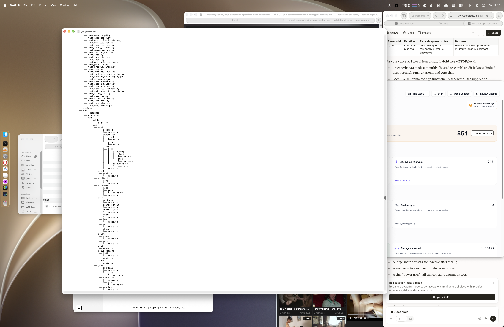

# AppleiMonitor

AppleiMonitor is a local-first macOS utility for understanding application usage, storage, cleanup opportunities, update status, and uninstall impact from one native SwiftUI dashboard.

The app is built as a Swift Package executable with a lightweight SQLite-backed core. It runs as a standard macOS app with an optional menu bar presence.

## Screenshots



| Usage Trends | Activity Timeline |
| --- | --- |
|  |  |

| Warnings | Updates |
| --- | --- |
|  |  |

| Quarantine Review | History |
| --- | --- |
|  |  |

## Features

- App inventory across common macOS application locations, with optional broader bundle discovery.
- Foreground app usage tracking with idle/session pause handling.
- Usage analytics for totals, daily trends, top apps, heatmaps, and timeline sessions.
- Spotlight usage import for historical last-used dates, use counts, and used days.
- Storage scans for app bundles and related Application Support, cache, container, preference, log, WebKit, cookie, and diagnostic paths.
- Quarantine review with exact-path preview, queued approval, restore, and action history flows.
- Large-file review and warning surfaces.
- App health checks for code signing, Gatekeeper, stale bundles, crashes, and permission-sensitive paths.
- Update checks for Mac App Store apps, Homebrew casks/formulae, Apple software updates, and direct-download apps with Sparkle feeds.
- Guided uninstall planning that moves selected app and support files to Trash.
- CSV exports for app tables, daily usage, timeline sessions, summaries, trend buckets, top apps, and heatmaps.

## How It Compares

AppleiMonitor is meant to sit between usage trackers, cleanup tools, update checkers, and uninstall helpers:

- Compared with pure usage trackers, it keeps local foreground usage history alongside app storage and health context.
- Compared with cleaner apps, it defaults to review and quarantine instead of permanent deletion.
- Compared with uninstall tools, it shows an uninstall plan and affected paths before moving selected items to Trash.
- Compared with update checkers, it combines Mac App Store, Homebrew, Apple software update, and Sparkle/direct-download signals in one local view.

This category is crowded, so AppleiMonitor's niche is the combination: usage history explains whether an app still matters, storage scans show what it owns, warnings flag review-worthy risk, updates show maintenance status, and quarantine-first cleanup keeps changes reversible. It is not trying to replace dedicated package managers, malware scanners, or deep disk visualizers. The goal is a native, local-first dashboard that makes app-related usage, storage, warnings, cleanup candidates, updates, and uninstall impact easier to inspect together.

## Requirements

- macOS 14 or newer.
- Xcode command line tools or Xcode with Swift 5.9 support.
- Optional: Homebrew and `mas` for Homebrew and Mac App Store update checks.

## Install

Install from source by building the app bundle:

```bash
git clone https://github.com/Dennesssy/AppleiMonitor.git
cd AppleiMonitor
./scripts/build_app.sh debug
open "build/AppleiMonitor.app"
```

## Build And Run

Run the test suite:

```bash
swift test
```

Build a runnable `.app` bundle:

```bash
./scripts/build_app.sh debug
```

Open the packaged app:

```bash
open "build/AppleiMonitor.app"
```

Run the full local check used by this repo:

```bash
./scripts/ci
```

You can also run the Swift package executable directly during development:

```bash
swift run AppMonitor
```

Some macOS app behaviors, including bundle identity, icon resources, menu bar behavior, login item behavior, and permission prompts, are best exercised through the packaged app from `scripts/build_app.sh`.

## Usage

AppleiMonitor runs from the menu bar or the dashboard window. After opening `build/AppleiMonitor.app`, look for its icon in the macOS status bar.

### Menu Bar

Tap the menu bar icon to open the popover. The popover shows the current summary cards for storage, usage, updates, warnings, and developer project bloat. Use it for quick checks without opening the full dashboard.

### Dashboard

Open the dashboard from the menu bar popover or by launching the app directly. The dashboard is organized around the left sidebar and the main detail area.

- **Sidebar**: choose the active section: Overview, Usage, Storage, Warnings, Updates, Uninstall, History, and Settings.
- **Overview**: see combined status across usage, storage, updates, warnings, and developer project bloat.
- **Usage**: inspect foreground app usage, daily trends, top apps, and timeline sessions.
- **Storage**: review app bundle sizes, related support files, caches, containers, logs, and quarantine candidates.
- **Warnings**: review flagged items such as large files, stale bundles, Gatekeeper issues, and permission-sensitive paths.
- **Updates**: check Mac App Store apps, Homebrew formulae and casks, Apple software updates, and apps with Sparkle feeds.
- **Uninstall**: preview what an app would remove, queue items, and send them to Trash.
- **History**: review past cleanup, restore, and uninstall actions.
- **Inspector**: select an item in the main view to open the detail inspector on the right, where exact paths, metadata, and actions are available.

### Quarantine and Restore

When cleanup candidates are selected, AppleiMonitor moves them to its quarantine area instead of deleting them immediately. Use History to review quarantined items and restore them if needed.

### Developer Projects

If enabled in Settings, AppleiMonitor scans configured developer project roots for project type, git status, and related bloat. Results appear in the dashboard and can inform storage or cleanup decisions.

### Privacy and Scope

AppleiMonitor is local-first. It stores data under `~/Library/Application Support/AppleiMonitor/` and does not send telemetry. Update checks may reach out to third-party sources or local tools such as Homebrew, `mas`, Apple `softwareupdate`, or configured Sparkle feeds.

## Packaging And Releasing

AppleiMonitor's packaged app includes a GitHub-hosted appcast URL. Release packages include a zip, a branded drag-to-Applications DMG, SHA-256 checksums, and an `appcast.xml` file for update discovery.

For local packaging:

```bash
./scripts/package_release.sh 1.2.0 3
```

For a Homebrew beta cask, publish a versioned beta GitHub release and generate the cask file for a tap:

```bash
APP_MONITOR_TAG="v1.2.0-beta.3" ./scripts/package_release.sh 1.2.0 3
./scripts/generate_homebrew_beta_cask.sh 1.2.0 3
```

The unsigned/ad-hoc local package is useful for development. Public distribution should use Developer ID signing and Apple notarization so Gatekeeper can verify the app. See [RELEASING.md](RELEASING.md) for the exact commands, signing options, and local verification steps.

## Privacy

AppleiMonitor is designed to run locally. It records app inventory, usage, storage scan, cleanup, uninstall, update, and settings data in a local SQLite database under `~/Library/Application Support/AppleiMonitor/`.

It does not include telemetry, accounts, or a hosted backend. Optional update checks may contact third-party update sources or run local update tools such as Homebrew, `mas`, Apple `softwareupdate`, or app-provided Sparkle feeds. See [PRIVACY.md](PRIVACY.md) for details.

## Safety Notes

AppleiMonitor can inspect local app-related storage and can move selected files to quarantine or Trash. Cleanup candidates are shown as a quarantine review: preview the exact path, queue only the items you approve, move them to AppleiMonitor quarantine, and restore from History while the quarantined item remains available. Review cleanup and uninstall plans before applying them, especially for containers, preferences, Application Support data, and group containers that may contain user data.

Update installs may require administrator authorization or third-party package manager behavior outside this project.

## Project Structure

- `Sources/AppMonitor`: SwiftUI app, dashboard, menu bar UI, and app lifecycle wiring.
- `Sources/AppMonitorCore`: inventory, usage tracking, storage scanning, cleanup, update, uninstall, analytics, export, and SQLite logic.
- `Tests/AppMonitorCoreTests`: focused core behavior tests.
- `scripts/build_app.sh`: builds and signs a local `.app` bundle.
- `scripts/ci`: runs tests and verifies app bundle creation.

## License

AppleiMonitor is released under the MIT License. See [LICENSE](LICENSE).
